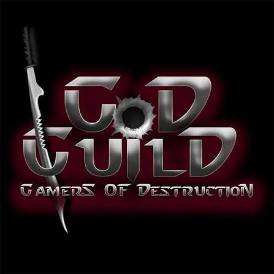

# GoD GuilD StudioS

### We don't make games. We build universes.

Interactive Entertainment Division of GoDGuilD · Est. 2018

---

## About Us

**GoD GuilD StudioS** is a full-cycle game development and co-development studio — architects of interactive realities, taking projects from concept to ship across PC, console, and mobile.

We run on a simple hybrid: **AAA ambition, indie soul.**

- **AAA Ambition** — every project gets top-tier production discipline: GDD-first development, locked milestones, documented acceptance criteria.
- **Indie Soul** — we protect creative vision and refuse safe-but-hollow design.
- **Multi-Platform First** — we engineer native platform experiences, not ports.
- **Partnership Over Service** — we invest creatively in client outcomes, not transactions.

**By the numbers:** 14+ shipped titles · 8 platforms · 20+ specialists · operations across 3 continents · 91% first-submission platform certification rate · <0.3% post-launch critical bug rate · 90-day post-launch support with 48-hour SLA on critical issues.

GoD GuilD StudioS is the **Interactive Entertainment Division** of [GoDGuilD](https://godguild.net), itself a Business Unit of [Parlee Conseiller](https://parlee.net).

---

## Our Craft

| Service | What We Deliver |
|---|---|
| **Story & Concept Forge** | Narrative frameworks, branching dialogue, world bibles, IP creation |
| **3D Modeling & Animation** | PBR pipelines, character rigs, motion capture integration, LOD chains |
| **Level & World Design** | Blockout pipelines, open-world biome design, environmental storytelling |
| **Gameplay Engineering** | Combat systems, ability systems, AI (behavior trees / GOAP), netcode, procedural generation |
| **Optimization & QA** | GPU/CPU profiling, automated testing, platform certification (TRC/TCR/LOT) |
| **Audio & Immersion Design** | Original scores, adaptive music (Wwise/FMOD), spatial audio, SFX |

**Genre specializations:** Action RPG · Adventure · Action · Casual & Hyper-Casual · Strategy & Simulation · Multiplayer & GaaS · Horror & Thriller · Sci-Fi & Cyberpunk

---

## Play Portal

| Title | Genre |
|---|---|
| **Running Riot** | Fast-paced endless runner with destructible environments |
| **BlockFall** | Physics-driven puzzle with gravity mechanics |
| **Neon Pulse** | Rhythm action in a neon-soaked future city |
| **SkyPulse** | Aerial combat with handcrafted sky arenas |
| **Neon Serpent** | Classic snake reimagined as a living weapon |
| **Void Invaders** | Procedural wave-based space defense |

---

## The GoDGuilD Network

GoD GuilD StudioS is one of five realms in the GoDGuilD universe:

| Realm | Focus | Domain |
|---|---|---|
| **GoDGuilD ClaN** | Warriors, alliances, guilds, social network | [clan.godguild.net](https://clan.godguild.net) |
| **GoD GuilD StudioS** | Game development & co-development *(this org)* | [studios.godguild.net](https://studios.godguild.net) |
| **GoDServerS** | Gaming server rental & hosting | [servers.godguild.net](https://servers.godguild.net) |
| **GoDGuilD eSports** | Streaming, tournaments, events, community | [esports.godguild.net](https://esports.godguild.net) |
| **GoDGuilD MetaVerse** | Digital asset marketplace (Minecraft, Fortnite/UEFN, Roblox) | [metaverse.godguild.net](https://metaverse.godguild.net) |

---

## Contact

- **Partnerships & inquiries:** studios@godguild.net
- **Web:** [studios.godguild.net](https://studios.godguild.net)
- **Network home:** [godguild.net](https://godguild.net)

---

© 2018–2026 GoD GuilD StudioS · A Parlee Conseiller Company

